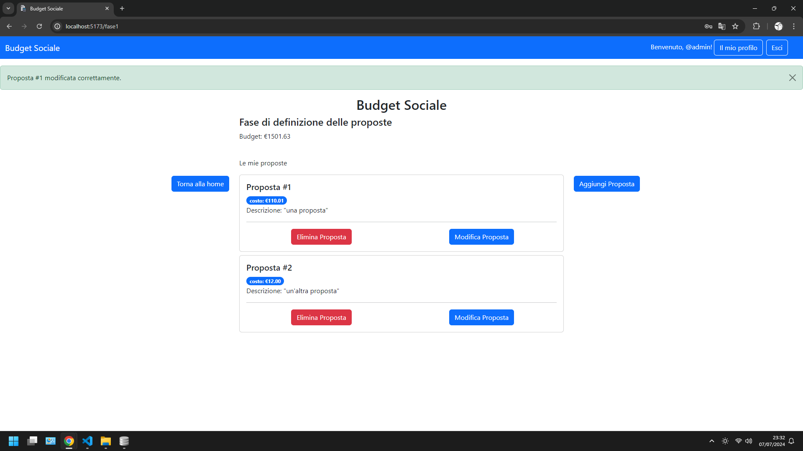
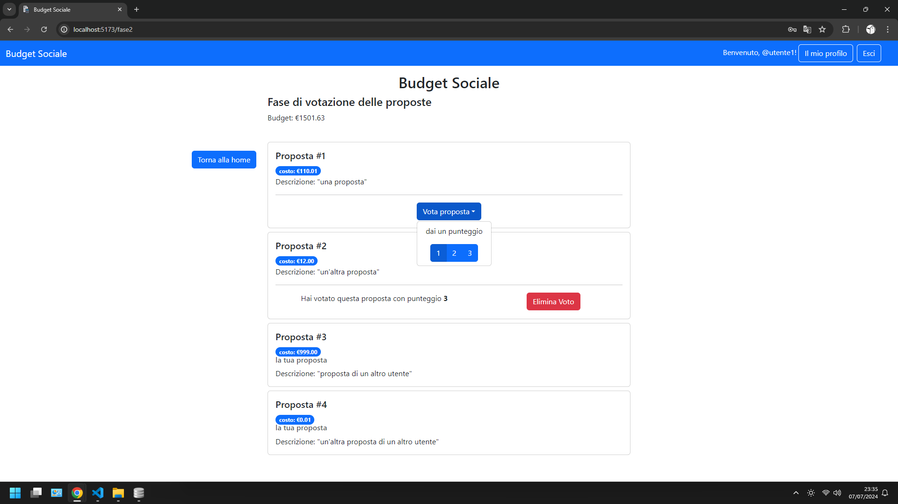

# Exam #2: "Budget Sociale"
## Student: s333017 TUMMINELLI SIMONE 

## Requirements, Dependencies
- Dependencies: node, react (everything else: in package.json, just npm install)
- Requirements: [requirements](./requirements.pdf)

## React Client Application Routes

- Route `/`: homepage del sito. Mostra le informazioni relative alla fase attuale e contiene i pulsanti per compiere le azioni consentite in base all'utente corrente e alla fase. Contiene inoltre i pulsanti per le operazioni di autenticazione (login, logout, registrazione).
- Route `/home`: route alternativa per `/`.
- Route `/fase1`: schermata di definizione delle proposte. Accessibile solo durante la fase 1 dopo essersi autenticati.
- Route `/fase2`: schermata di votazione delle proposte. Accessibile solo durante la fase 2 dopo essersi autenticati.
- Route `/fase3`: schermata di visualizzazione delle proposte approvate. Accessibile solo durante la fase 3.
- Route `/profilo`: schermata del profilo utente. Contiene le informazioni sull'utente autenticato e i dati riguardanti le proposte e le preferenze espresse, coerentemente alla fase corrente.
- Route `/accedi`: schermata di accesso. Contiene un form in cui inserire username e password.
- Route `/registrati`: schermata di registrazione di un nuovo utente. Contiene un form in cui inserire username e password.
- Route `*`: schermata generica di errore per route inesistente.

## API Server

- GET `/api/budgetSociale`
  - Scopo: ottenere lo stato attuale dell'applicazione con le informazioni relative alla fase e al budget.
  - Parametri della richiesta: nessuno.
  - Contenuto della richiesta (body): nessuno.
  - Contenuto della risposta: 
    - status `200` (success) e oggetto budgetSociale in formato json. 
    - status `500` (internal server error) in caso di errore. 
  ```
  res.body: {
    "budgetSocialeID": budgetSocialeID,
    "budget": budget,
    "fase": fase
  }
  ``` 

- PATCH `/api/budgetSociale`
  - Scopo: modificare lo stato attuale dell'applicazione, in particolare:
    - Dalla fase 0 alla fase 1 avviene la modifica dei campi "fase" e "budget" della tabella "budget_sociale" del database.
    - Dalla fase 1 alla fase 2 avviene la modifica del campo "fase" della tabella "budget_sociale".
    - Dalla fase 2 alla fase 3 avviene la modifica del campo "fase" della tabella "budget_sociale" e vengono aggiornati i dati della tabella "proposte" calcolando per ogni proposta il punteggio totale e impostando lo stato di approvazione in base al punteggio totale e al budget totale definito nella fase 0.
    - Durante il riavvio (dalla fase 3 alla fase 0) azzera i campi "fase" e "budget" della tabella "budget_sociale" ed elimina tutti i dati dalle tabelle "proposte" e "preferenze".
  - Parametri della richiesta: nessuno.  Nella richiesta è contenuto l'utente autenticato.
  - Contenuto della richiesta (body): oggetto budgetSociale in formato json.
  - Contenuto della risposta: 
    - status `200` (success) se l'operazione va a buon fine.
    - status `401` (unauthorized) se l'utente non è autenticato o se l'utente non è l'amministratore.
    - status `422` (unprocessable entity) se i campi del body non superano i controlli di validazione (fase: intero compreso tra 0 e 3, budget: float maggiore di 0).
    - status `500` (internal server error) in caso di errore.
  ```
  req.user: {
    "utenteID": utenteID,
    "username": username,
    "tipo": tipo
  }
  ```
  ```
  req.body: {
    "budgetSocialeID": budgetSocialeID,
    "budget": budget,
    "fase": fase
  }
  ```

- GET `/api/proposte`
   - Scopo: ottenere tutte le proposte. Quando viene chiamata durante la fase 2 le preferenze delle proposte sono solo quelle relative all'utente autenticato.
   - Parametri della richiesta: nessuno. Nella richiesta è contenuto l'utente autenticato.
   - Contenuto della richiesta (body): nessuno.
   - Contenuto della risposta: 
     - status `200` (success) e vettore di proposte.
     - status `500` (internal server error) in caso di errore.
  ```
  req.user: {
    "utenteID": utenteID,
    "username": username,
    "tipo": tipo
  }
  ```
  ```
  res.body: {[{
    "propostaID": propostaID,
    "utenteID": utenteID,
    "username": username,
    "descrizione": descrizione,
    "costo": costo, 
    "punteggio": punteggio,
    "approvata": approvata,
    "preferenze": [{
        "preferenzaID": preferenzaID,
        "utenteID": utenteID,
        "propostaID": propostaID,
        "punteggio": punteggio
    }]
  }]}
  ```

- GET `/api/proposteFaseFinale`
  - Scopo: ottenere tutte le proposte con informazioni relative all'approvazione.
  - Parametri della richiesta: nessuno. Nella richiesta è contenuto l'utente autenticato.
  - Contenuto della richiesta (body): nessuno.
  - Contenuto della risposta:
    - status `200` (success) e due vettori di proposte: proposteApprovate e proposteNonApprovate. Se l'utente non è autenticato proposteNonApprovate è null.
    - status `401` (unauthorized) se la richiesta viene fatta durante una fase diversa dalla fase 3.
    - status `500` (internal server error) in caso di errore.
  ```
  req.user: {
    "utenteID": utenteID,
    "username": username,
    "tipo": tipo
  }
  ```
  ```
  res.body: {
    "proposteApprovate": [{
        "propostaID": propostaID,
        "utenteID": utenteID,
        "username": username,
        "descrizione": descrizione,
        "costo": costo, 
        "punteggio": punteggio,
        "approvata": approvata,
        "preferenze": [{
            "preferenzaID": preferenzaID,
            "utenteID": utenteID,
            "propostaID": propostaID,
            "punteggio": punteggio
        }]
    }],
    "proposteNonApprovate": [{
        "propostaID": propostaID,
        "utenteID": utenteID,
        "username": username,
        "descrizione": descrizione,
        "costo": costo, 
        "punteggio": punteggio,
        "approvata": approvata,
        "preferenze": [{
            "preferenzaID": preferenzaID,
            "utenteID": utenteID,
            "propostaID": propostaID,
            "punteggio": punteggio
        }]
    }],
  }
  ```

- GET `/api/proposte/:utenteID`
  - Scopo: ottenere tutte le proposte dell'utente corrispondente all'id "utenteID".
  - Parametri della richiesta: utenteID. Nella richiesta è contenuto l'utente autenticato, l'id dell'utente autenticato e il parametro devono coincidere.
  - Contenuto della richiesta (body): nessuno. 
  - Contenuto della risposta: 
    - status `200` (success) e vettore di proposte.
    - status `401` (unauthorized) se la richiesta viene fatta durante una fase diversa dalla fase 1 o se l'utente autenticato ha un id diverso dal parametro utenteID.
    - status `404` (not found) se non esiste nessun utente con id corrispondente a utenteID.
    - status `500` (internal server error) in caso di errore.
  ```
  req.user: {
    "utenteID": utenteID,
    "username": username,
    "tipo": tipo
  }
  ```
  ```
  res.body: {[{
    "propostaID": propostaID,
    "utenteID": utenteID,
    "username": username,
    "descrizione": descrizione,
    "costo": costo, 
    "punteggio": punteggio,
    "approvata": approvata,
    "preferenze": [{
        "preferenzaID": preferenzaID,
        "utenteID": utenteID,
        "propostaID": propostaID,
        "punteggio": punteggio
    }]
  }]}
  ```

- POST `/api/proposte`
  - Scopo: salvare nel database una proposta.
  - Parametri della richiesta: nessuno. La richiesta contiene l'utente autenticato.
  - Contenuto della richiesta (body): proposta.
  - Contenuto della risposta: 
    - status `201` (created) e propostaID della proposta appena salvata.
    - status `409` (conflict) se ci sono conflitti tra richiesta e contenuto attuale del database, in particolare: utenteID della proposta diverso da utenteID dell'utente autenticato, costo della proposta superiore al budget complessivo, l'utente ha già 3 proposte salvate nel database.
    - status `401` (unauthorized) se la richiesta viene fatta in una fase diversa dalla fase 1.
    - status `422` (unprocessable entity) se i campi della proposta non superano i controlli di validazione (utenteID: numero intero, descrizione: stringa non vuota di lunghezza massima 60 caratteri, costo: float maggiore di 0).
    - status `500` (internal server error) in caso di errore.
  ```
  req.user: {
    "utenteID": utenteID,
    "username": username,
    "tipo": tipo
  }
  ```
  ```
  req.body: {
    "propostaID": null,
    "utenteID": utenteID,
    "username": username,
    "descrizione": descrizione,
    "costo": costo, 
    "punteggio": 0,
    "approvata": 0,
    "preferenze": null
  }
  ```
  
- PATCH `/api/proposte`
  - Scopo: modificare una proposta precedentemente inserita.
  - Parametri della richiesta: nessuno. Nella richiesta è contenuto l'utente autenticato.
  - Contenuto della richiesta (body): proposta.
  - Contenuto della risposta: 
    - status `204` (no content) in caso di modifica andata a buon fine. 
    - status `401` (unauthorized) se la richiesta viene fatta in una fase diversa dalla fase 1 o se l'id dell'utente autenticato non corrisponde al campo utenteID contenuto nella proposta.
    - status `422` (unprocessable entity) se i campi della proposta non superano i controlli di validazione (utenteID: numero intero, descrizione: stringa non vuota di lunghezza massima 60 caratteri, costo: float maggiore di 0).
    - status `409` (conflict) se il costo della proposta è superiore al budget complessivo.
    - status `500` (internal server error) in caso di errore.
  ```
  req.user: {
    "utenteID": utenteID,
    "username": username,
    "tipo": tipo
  }
  ```
  ```
  req.body: {
    "propostaID": propostaID,
    "utenteID": utenteID,
    "username": username,
    "descrizione": descrizione,
    "costo": costo, 
    "punteggio": 0,
    "approvata": 0,
    "preferenze": null
  }
  ```

- DELETE `/api/proposte/:propostaID`
  - Scopo: eliminare una proposta precedentemente inserita.
  - Parametri della richiesta: propostaID. Nella richiesta è contenuto l'utente autenticato.
  - Contenuto della richiesta (body): nessuno.
  - Contenuto della risposta: 
    - status `204` (no content) in caso di eliminazione andata a buon fine. 
    - status `404` (not found) se nel database non c'è nessuna proposta con id uguale al parametro della richiesta.
    - status `401` (unauthorized) se la richiesta viene fatta in una fase diversa dalla fase 1 o se l'id dell'utente autenticato non corrisponde al campo utenteID della proposta.
    - status `500` (internal server error) in caso di errore.
  ```
  req.user: {
    "utenteID": utenteID,
    "username": username,
    "tipo": tipo
  }
  ```

- POST `/api/preferenze`
  - Scopo: salvare nel database una preferenza (votazione con punteggio) relativa a una proposta.
  - Parametri della richiesta: nessuno. Nella richiesta è contenuto l'utente autenticato.
  - Contenuto della richiesta (body): preferenza.
  - Contenuto della risposta: 
    - status `201` (created) e id della preferenza appena inserita nel database.
    - status `401` (unauthorized) se la richiesta viene fatta in una fase diversa dalla fase 2 o se la proposta relativa alla preferenza è associata all'utente autenticato (un utente non può votare una delle sue proposte).
    - status `409` (conflict) se l'utente ha già espresso una preferenza per la relativa proposta.
    - status `422` (unprocessable entity) se i campi della preferenza non superano i controlli di validazione (utenteID: numero intero, propostaID: numero intero, punteggio: numero intero compreso tra 1 e 3).
    - status `500` (internal server error) in caso di errore.
  ```
  req.user: {
    "utenteID": utenteID,
    "username": username,
    "tipo": tipo
  }
  ```
  ```
  req.body{
    "preferenzaID": null,
    "utenteID": utenteID,
    "propostaID": propostaID,
    "punteggio": punteggio
  }
  ```

- DELETE `/api/preferenze/:preferenzaID`
  - Scopo: eliminare una preferenza precedentemente espressa.
  - Parametri della richiesta: id della preferenza da eliminare. Nella richiesta è contenuto l'utente autenticato.
  - Contenuto della richiesta (body): nessuno
  - Contenuto della risposta: 
    - status `204` (no content) in caso di eliminazione andata a buon fine. 
    - status `404` (not found) se nel database non c'è nessuna preferenza con id corrispondente al parametro della richiesta.
    - status `401` (unauthorized) se la richiesta viene fatta in una fase diversa dalla fase 2 o se l'id dell'utente autenticato non corrisponde al campo utenteID della preferenza.
    - status `500` (internal server error) in caso di errore.
  ```
  req.user: {
    "utenteID": utenteID,
    "username": username,
    "tipo": tipo
  }
  ```

- POST `/api/sessions`
  - Scopo: effettuare il login.
  - Parametri della richiesta: nessuno.
  - Contenuto della richiesta (body): credenziali utente.
  - Contenuto della risposta: 
    - status `200` (success) e utente in formato json (contenente id, username e tipo). 
    - status `422` (unprocessable entity) se i campi del body non superano i controlli di validazione (username e password devono essere stringhe non vuote che non contengono spazi).
    - status `401` (unauthorized) in caso di credenziali errate.
    - status `500` (internal server error) in caso di errore.
  ```
  req.body: {
    "username": username,
    "password": password
  }
  ```
  ```
  res.body: {
    "utenteID": utenteID,
    "username": username,
    "tipo": tipo
  }
  ```

- GET `/api/sessions/current`
  - Scopo: controllare che l'utente corrente sia autenticato.
  - Parametri della richiesta: nessuno. Nella richiesta è contenuto l'utente corrente.
  - Contenuto della richiesta (body): nessuno.
  - Contenuto della risposta: 
    - status `200` (success) e utente  in formato json.
    - status `401` (unauthorized) in caso di utente non autenticato.
    - status `500` (internal server error) in caso di errore.
  ```
  req.user: {
    "utenteID": utenteID,
    "username": username,
    "tipo": tipo
  }
  ```
  ```
  res.body: {
    "utenteID": utenteID,
    "username": username,
    "tipo": tipo
  }
  ```

- DELETE `/api/sessions/current`
  - Scopo: effettuare il logout.
  - Parametri della richiesta: nessuno. Nella richiesta è contenuto l'utente autenticato.
  - Contenuto della richiesta (body): nessuno.
  - Contenuto della risposta: 
    - status `204` (no content) per logout andato a buon fine.
    - status `500` (internal server error) in caso di errore.
  ```
  req.user: {
    "utenteID": utenteID,
    "username": username,
    "tipo": tipo
  }
  ```

- POST `/api/nuovoUtente`
  - Scopo: registrare un nuovo utente.
  - Parametri della richiesta: nessuno.
  - Contenuto dela richiesta (body): credenziali dell'utente da registrare.
  - Contenuto della risposta: 
    - status `201` (created) e utente appena creato in formato json.
    - status `422` (unprocessable entity) se i campi del body non superano i controlli di validazione (username e password devono essere stringhe non vuote che non contengono spazi).
    - status `409` (conflict) se esiste già un utente con l'username inserito.
    - status `500` (internal server error) in caso di errore.
  ```
  req.body: {
    "username": username,
    "password": password
  }
  ```
  ```
  res.body: {
    "utenteID": utenteID,
    "username": username,
    "tipo": tipo
  }
  ```

## Database Tables

- Table `budget_sociale` - contiene:
  - budgetID: chiave primaria unica di tipo numerico auto-incrementale, valore non nullo
  - fase: valore interno non nullo
  - budget: valore reale non nullo
- Table `utenti` - contiene:
    - utenteID: chiave primaria unica di tipo numerico auto-incrementale, valore non nullo
  - username: valore unico di tipo testuale non nullo
  - tipo: valore intero non nullo (per admin: -1, default: 0)
  - hash: valore di tipo testuale non nullo
  - salt: valore di tipo testuale non nullo
- Table `proposte` - contiene:
  - propostaID: chiave primaria unica di tipo numerico auto-incrementale, valore non nullo
  - utenteID: chiave esterna riferita alla tabella `utenti`, valore non nullo
  - descrizione: valore di tipo testuale non nullo
  - costo: valore reale non nullo
  - punteggio: valore interno non nullo
  - approvata: valore interno non nullo
- Table `preferenze` - contiene:
  - preferenzaID: chiave primaria unica di tipo numerico auto-incrementale, valore non nullo
  - utenteID: chiave esterna riferita alla tabella `utenti`, valore non nullo
  - propostaID: chiave esterna riferita alla tabella `proposte`, valore non nullo
  - punteggio: valore intero non nullo

## Main React Components

- `MyHeader` in (`MyHeader.jsx`): header comune a tutte le schermate del sito. Consente di effettuare il logout e di navigare verso le pagine home, login, profilo e registrazione. 
- `AccediForm` (in `ComponentiAutenticazione.jsx`): form per effettuare il login.
- `RegistratiForm` (in `ComponentiAutenticazione.jsx`): form per effettuare la registrazione.
- `LogoutButton` (in `ComponentiAutenticazione.jsx`): pulsante per effettuare il logout.
- `Home` (in `Home.jsx`): schermata principale del sito. Consente all'amministratore di avanzare di fase, impostare il budget durante la fase 0 e riavviare il processo durante la fase 3. A tutti gli utenti autenticati consente di navigare verso le schermate `PrimaFase`, `SecondaFase` e `TerzaFase` coerentemente alla fase corrente ("TerzaFase" è accessibile anche dagli utenti non autenticati). Contiene anche una spiegazione del funzionamento del sito. Inoltre consente di verificare la fase corrente tramite il bottone `BottoneControllaAggiornamento`.
- `BottoneControllaAggiornamento` (in `Home.jsx`): bottone che manda una "GET /budgetSociale" e aggiorna lo stato attuale dei componenti se la fase è cambiata, coerentemente al tipo di utente corrente. Lo scopo di questo bottone è evitare un refresh manuale della pagina e allo stesso tempo evitare un loop infinito di richieste "GET /budgetSociale" per verificare l'aggiornamento della fase.
- `Proposta` (in `Proposta.jsx`): componente contenente una card con le informazioni di una proposta (descrizione, prezzo, username dell'autore, preferenze espresse). Questo componente è usato durante le fasi 1, 2, 3 mostrando informazioni e consentendo azioni coerentemente a ogni fase, in particolare:
  - durante la fase 1: sono mostrati i bottoni per modificare ed eliminare la proposta, l'username e le preferenze non sono mostrati.
  - durante la fase 2: sono mostrati i bottoni per essegnare o eliminare una preferenza, è mostrata l'eventuale preferenza espressa dall'utente autenticato ma non quelle degli altri utenti, così come l'username. Le proposte dell'utente autenticato (non votabili) sono contrassegnate dalla dicitura "la mia proposta".
  - durante la fase 3: se la proposta è approvata sono mostrati i punti ottenuti durante la votazione e l'username, se non è approvata l'username non è mostrato.
- `PrimaFase` (in `PrimaFase.jsx`): schermata accessibile durante la prima fase dagli utenti autenticati, contiene la lista di componenti `Proposta` relativi all'utente con la possibilità di aggiunta tramite un bottone che mostra `ModaleAggiungiProposta` se le proposte totali sono minori di 3, di modifica tramite un bottone che mostra `ModaleModificaProposta` e di eliminazione tramite il bottone `BottoneEliminaProposta`.
- `ModaleAggiungiProposta` (in `PrimaFase.jsx`): modale contenente un form per aggiungere una nuova proposta.
- `ModaleModificaProposta` (in `PrimaFase.jsx`): modale contenente un form per modificare una proposta esistente, il form è precompilato e con i dati attuali della proposta.
- `BottoneEliminaProposta` (in `PrimaFase.jsx`): bottone che consente di eliminare una proposta precedentemente inserita.
- `SecondaFase` (in `SecondaFase.jsx`): schermata accessibile durante la seconda fase dagli utenti autenticati, contiene la lista completa di componenti `Proposta` con la possibilità di esprimere una preferenza per le proposte degli altri utenti tramite il componente `DropdownVotazione` oppure di eliminare una preferenza espressa tramite il componente `BottoneEliminaVoto`.
- `DropdownVotazione` (in `SecondaFase.jsx`): dropdown al cui interno vi è una lista di 3 bottoni contrassegnati dai valori "1", "2" e "3". Cliccando è possibile assegnare alla proposta la preferenza con punteggio corrispondente.
- `BottoneEliminaVoto` (in `SecondaFase.jsx`): bottone che consente di eliminare una preferenza precedentemente espressa.
- `TerzaFase` (in `TerzaFase.jsx`): schermata accessibile da tutti gli utenti durante la terza fase, contiene due liste di componenti `Proposta`, una per le proposte approvate e un'altra per le proposte non approvate. Entrambe le liste sono ordinate per punteggio della proposta decrescente.
- `Profilo` (in `Profilo.jsx`): schermata accessibile dagli utenti autenticati durante tutte le fasi, contiene le informazioni relative all'utente e tre liste di componenti `Proposta`: le proprie proposte approvate, le proprie proposte non approvate e le proposte per cui si è espressa una preferenza. Le informazioni mostrate sono coerenti alla fase corrente, in particolare: durante la fase 0 non ci sono proposte da mostrare, durante la fase 1 sono mostrate le proprie proposte inserite, durante la fase 2 le proprie proposte inserite (senza punteggio) e le proposte per cui si è espressa una preferenza (senza username) e durante la fase 3 le proprie proposte divise in approvate (con punteggio) e non approvate (senza punteggio) e le proposte votate con punteggio totale e username solo se approvate.

## Screenshot




## Users Credentials

- username: `admin`, password: `admin`
- username: `utente1`, password: `password1`
- username: `utente2`, password: `password2`
- username: `utente3`, password: `password3`
